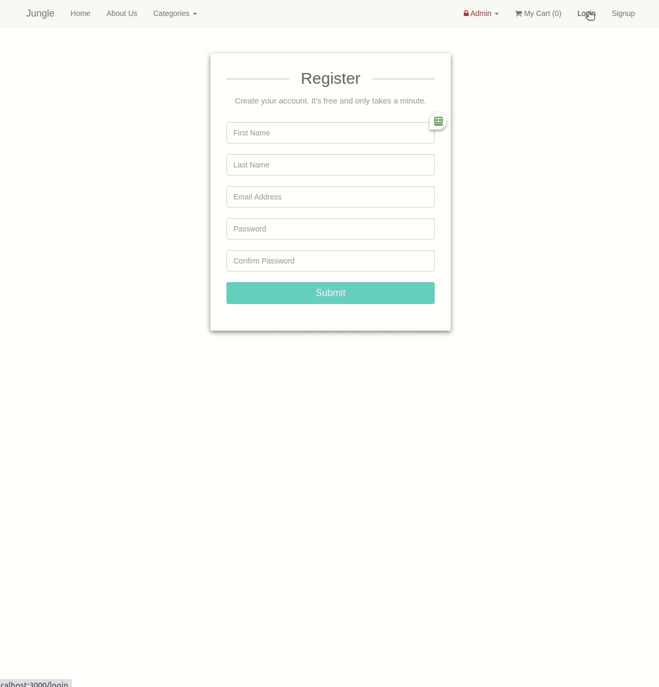

### Jungle is a Ruby on Rails E-commerce application which allows users to purchase goods and make payments through use of the Stripe API.

 
 

## Skills on Display

- [x] Navigating an existing code-base
- [x] Learn a new paradigm, language and framework
- [x] Ruby
- [x] Rails 4.2
- [x] ERB Templating
- [x] Stripe API
- [x] Active Record
- [x] PostgreSQL
- [x] RSpec
- [x] Capybara::Poltergeist

## Features

- Products are displayed and can be added to a cart
- A sale banner is displayed when there is an active sale, prices are reflective of the sale
- When a product has 0 stock on hand, a 'SOLD OUT!' badge is displayed
- A sold out item cannot be added to the cart
- A detailed products page displays product information and product reviews
- Stock is adjusted from the quantity of items purchased
- Items in the cart can be adjusted
- Discounts and total prices are displayed in the cart
- A cart can paid for through a stripe transaction
- An email receipt is sent on a successful purchase
 (http://localhost:3000/rails/mailers/user_mailer/receipt_email)
- An order confirmation is displayed

- Visitors can go to the registration page in order to create an account
- Uniqueness validation prevents registration with existing email addresses
- Passwords are hashed and not stores as plain text in the database

- Users can sign in with a registered email address and password combination
- Users can write reviews and rate product and delete their specific reviews

- Admins can sign in through HTTP auth login/password to access admin functionality
- Admin users can add / remove categories
- Admin users can add / remove products
- Admin users can view orders
- Admin users can add / remove sales

---

## Getting Started

1. Run `bundle install` to install dependencies
2. Create `config/database.yml` by copying `config/database.example.yml`
3. Create `config/secrets.yml` by copying `config/secrets.example.yml`
4. Run `bin/rake db:reset` to create, load and seed db
5. Create .env file based on .env.example
6. Sign up for a Stripe account
7. Put Stripe (test) keys into appropriate .env vars
8. Run `bin/rails s -b 0.0.0.0` to start the server

The app will be served at <http://localhost:3000/>.

Use Credit Card # 4111 1111 1111 1111 for testing success scenarios.
More information in their docs: https://stripe.com/docs/testing#cards

Admin Username & Password: Jungle / book

---

## Dependencies & Dev Dependencies

- Ruby 2.3.5
- * Rails 4.2 
[Rails Guide](http://guides.rubyonrails.org/v4.2/)
- PostgreSQL 9.x
- Stripe
- sass-rails 5.x
- uglifier 1.3.0
- jquery-rails
- turbolinks
- jbuilder 2.x
- sdoc
- faker
- money-rails
- bcrypt 3.1.7
- bootstrap-sass 3.3.6
- font-awesome-rails
- money-rails
- carrierwave
- rmagick
- faker
- database_cleaner
